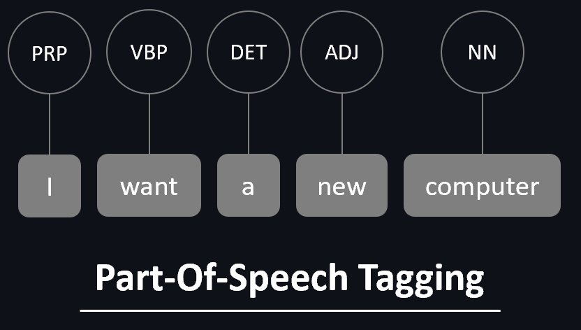

<h1 align="center">POS Tagging & Shallow Parsing with Keras</h1> 

<p align="center"> 
<a href="https://github.com/lprtk/keras-pos-tagging/issues"></a> 
<a href="https://github.com/lprtk/keras-pos-tagging/network"></a> 
<a href="https://github.com/lprtk/keras-pos-tagging/stargazers"></a> 
<a href="https://github.com/lprtk/keras-pos-tagging/"></a> 
</p> 


<p align="center">

</p>


## Table of contents 
* [Content :mag_right:](#Content)
* [Requirements :page_with_curl:](#Requirements)
* [File details :open_file_folder:](#File-details)
* [Features :computer:](#Features) 

<a id='section01'></a> 
## Content 

<p align="justify"> This project was realized in the context of an introductory course on Deep Learning applied to NLP. From sentences, composing a text, as well as the grammatical positions of each word, we had to use Part-Of-Speech Tagging (POS-Tagging) and Shallow-Parsing (chuncking) models in order to extract "hidden" information and the existing relations between words in a text. The objective is to use Deep Learning to quantify:<p> 
<ul>
<li><p align="justify">The difference between a POS-Tagging and Shallow-Parsing model; </p></li>
<li><p align="justify">The contribution, in the architecture, of a pre-trained embedding layer and of back-propagation to the vector representation of the embedding layer; </p></li>
<li><p align="justify">The impact on the predictive capacity of the models of more or less context around the word, whose grammatical tag is to be predicted, by varying the ngram range; </p></li>
<li><p align="justify">The difference between an architecture implementing a per-task model versus a multi-task architecture; </p></li>
<li><p align="justify">The difference between a simple multi-task model and a hierarchical multi-task model consisting in building a cascade architecture where the tasks do not intervene at the same depth of the neural network.</p></li>
</ul>

<a id='section02'></a> 
## Requirements
* **Python version 3.9.7** 
* **Install requirements.txt** 
```console
$ pip install -r requirements.txt 
``` 


<a id='section03'></a> 
## File details
* **requirements** 
  * This folder contains a .txt file with all the packages and versions needed to run the project. 
* **NLP_from_scratch** 
  * This is a .ipynb file which are the TP. 
* **data_utils**
  * This folder contains Python files that are used as a package in the notebook.
* **data**
  * This folder contains the data.

</br> 

Here is the project pattern: 
```
- project 
    > keras-POS-Tagging
        > requirements 
            - requirements.txt
        > image 
            - MLP.PNG
            - mtl_images.PNG
            - pos_tagging.PNG
        - NLP_from_scratch.ipynb 
        > data_utils 
            - pos.py
            - utils.py
        > data 
            - test.txt
            - test_chunk.txt
            - train.txt
            - train_chunk.txt
            - vocab.txt
            - wordVectors.txt
```

<a id='section04'></a> 
## Features 
<p align="center"><a href="https://github.com/lprtk/lprtk ">My profil</a> • 
<a href="https://github.com/lprtk/lprtk ">My GitHub</a> </p>
